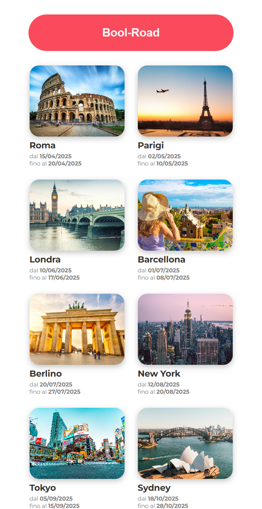
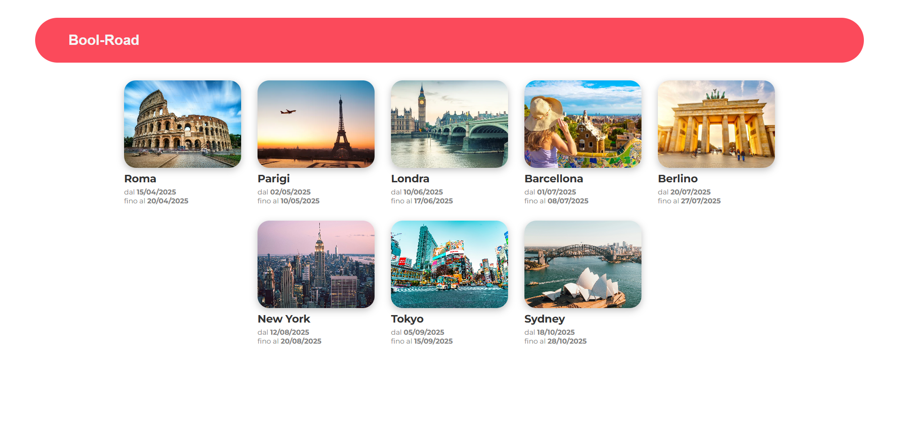
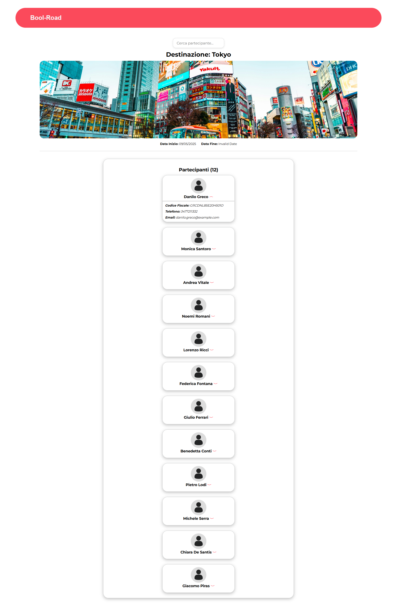

# BooRoad – Travel Companion App

## #Mobile

## #Desktop

## 🇬🇧 English Version

BooRoad is a digital tool designed for travel guides who manage groups during organized trips.  
Its purpose is to replace the current Excel workflow with a fast, simple and mobile-first web app.

The goal is to give guides immediate access to all traveller contact information, ensuring quick communication in case of emergencies.  
The company will also have a desktop interface to manage customer data, trips and guide assignments.

The system focuses on:
- speed and simplicity  
- quick access with PIN  
- mobile-first usage  
- synchronized data between guides and company  

---

## 🇮🇹 Versione Italiana

BooRoad è uno strumento digitale pensato per le guide turistiche che gestiscono gruppi nei viaggi organizzati.  
L’obiettivo è sostituire gli attuali file Excel con una web app veloce, intuitiva e ottimizzata per smartphone.

La guida può accedere rapidamente ai contatti dei viaggiatori, così da poterli raggiungere subito in caso di emergenza.  
L’azienda dispone invece di una versione desktop per gestire i dati, i viaggi e le assegnazioni delle guide.

Il sistema punta su:
- velocità e facilità d’uso  
- accesso rapido tramite PIN  
- utilizzo principalmente mobile  
- sincronizzazione tra app guida e back-office  

